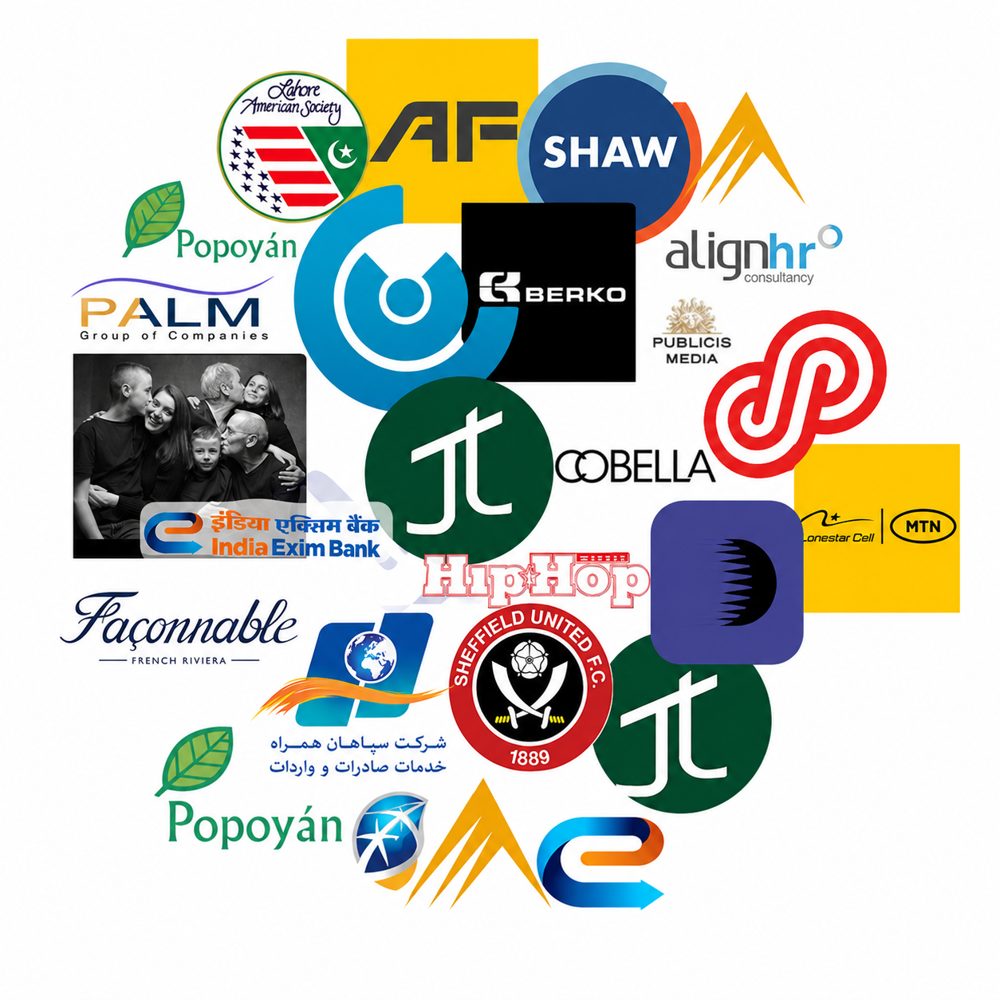

  

# Logo Classifier

This project was created for the Spring 2026 DIS Copenhagen course **Artificial Neural Networks and Deep Learning D**. Our goal was to build a deep learning model capable of classifying company logos into industry sectors based solely on visual features.

Logos are powerful visual signals that shape brand perception, influencing recognition, trust, and consumer behavior. By applying computer vision to a large dataset of brand logos, this project investigates whether visual design patterns can reveal meaningful connections to a company’s industry identity.

We collected and labeled a large logo dataset using sector categories we defined, then trained [EfficientNet-B0](https://docs.pytorch.org/vision/main/models/generated/torchvision.models.efficientnet_b0.html) to classify logos by sector. Through this process, we explored how effectively deep learning can infer industry-level information from logo imagery alone.

---

  <a href="https://docs.google.com/document/d/1R4WdnvLlnL8vmv9-cv3ibTUSvB2eDP9dR-IdrZXV56A/edit?usp=sharing">Notes</a> - <a href="">Blog</a>

---

## Quickstart

This project is designed to run in a **Kaggle Notebook** environment. Instead of requiring local installation, the notebook uses Kaggle’s built-in GPU support and dataset input system.

To run the project:

1. Open the notebook on Kaggle.
2. Add the required datasets using the **Add Input** button.
3. Make sure the logo images and label CSV files are available under `/kaggle/input/`.
4. Run the notebook from top to bottom.

During execution, the notebook loads the logo dataset, maps each company logo to a sector label, preprocesses the images, trains the classification model, and evaluates its performance. Any generated outputs, including trained model files or result CSVs, will be written to `/kaggle/working/`.

## Acknowledgements

This project was advised under the mentorship of our instructor Matthias Heumesser. This template was based on based on [Audrey
Feldroy\'s](https://github.com/audreyfeldroy)\'s great
[cookiecutter-pypackage](https://github.com/audreyfeldroy/cookiecutter-pypackage)
repository.
